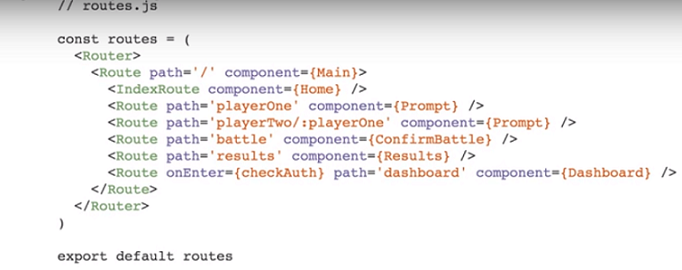

> #Yaay React!
This is a practice sheet for React by following tyler mcginnis bootcamp
- Whenever you use jsx we use the react import

### Static Routing & Dynamic Routing
- We declare our routes statistically as part of our app's initialization was used with versions prior to react router v4

previously routes were defined as follows

static routing is not bad but not react way
- Routing takes place as our app is rendering
- _With react rouer v4 everything is a_ **component**

- Since react router version4 we need to use `react-router-dom` package instead of the `react-router` package
- BrowserRouter,Route,Link are all components 
- We need to wrap our parent element div which contains our app into `<BrowserRouter>`
- #### `<Route/>` can be used to match a certain component we create
 #### Note:
  
   - When we go to other routes we can still see our home component reason being that home is linked to the `path='/'` and all our routes have slash in their paths to avoid this we can use the exact keyword to match it to that path